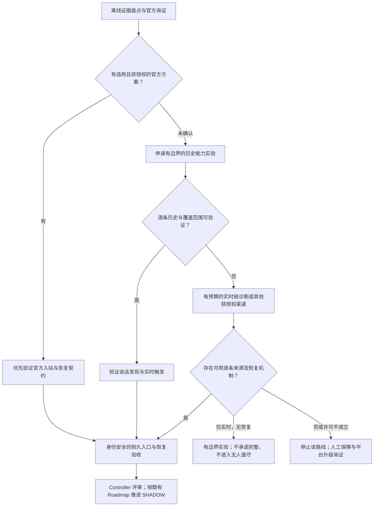
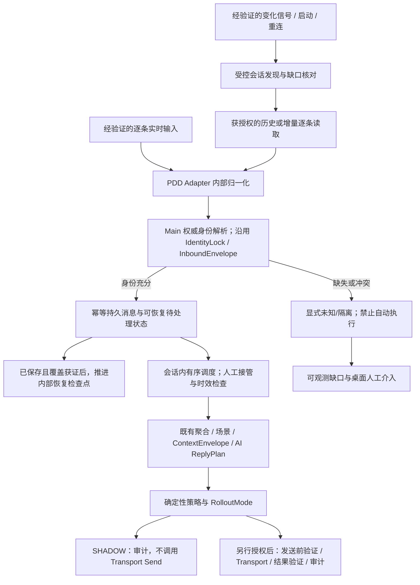

> **DERIVED / REDACTED (2026-09-23).** Historical 2026-09-20 evidence, not an original byte-for-byte record or current authorization. See [package notice](../README.md).

# 快羊 PDD 入站消息：总工程建议与分阶段规划

> 日期：2026-09-20（Asia/Shanghai）
> 文档性质：**工程建议稿，供 Owner / Controller 评审；不是执行授权，也不替代既有 Roadmap、产品或架构权威。**
> 对应问题：连续消息只观察到最后一条、空闲期间 latest 请求停止、Titan 有二进制活动但业务正文尚未确认。
> 本次交付：综合已有诊断与第三方源码审阅，给出技术选择、工作包、验收和停止条件；**不声称已修复接收问题。**
> 证据基线：2026-09-20 的既有报告；`zhinianboke/pdd-auto-reply` 固定提交 `61dac37fb6c329ca397c8bb03d274421254b1498`。本次没有重新开展最新版本检索，也没有重新执行第三方项目。

---

## 1. 一页结论：建议往哪条路走

**核心建议：先证明能够逐条取得并补回消息，再解决“多快发现变化”，最后接入已有 AI 客服闭环。不要把完全解开 Titan 当成所有后续工作的唯一前提。**

这是基于现有证据的工程判断（`INFERRED`），不是平台能力已获验证的结论。

### 1.1 推荐路线

1. **官方接入询证并行推进。** 如果平台提供适用、可授权的客服入站与回放能力，优先采用；现在的证据不足以判断“官方没有”。
2. **优先验证逐条历史/增量读取。** `zhinianboke/pdd-auto-reply` 给出了 `/plateau/chat/list` 的具体代码线索。它比继续加快 latest 轮询更值得做最小验证，但仍需先有权限与实验授权。
3. **独立验证实时信号。** Titan 若能解出逐条消息，就作为实时输入候选；若只能提供有效变更通知，就作为历史核对触发器。只有帧数增加而无业务语义，不能视为接通。
4. **用耐久入站、身份校验、幂等和恢复检查点接住输入。** AI 快慢、队列积压、人工接管不能让接收证据静默消失。
5. **按既有 Roadmap 推进到 SHADOW，再评估 HUMAN_CONFIRM。** 收消息能力通过，不等于已经允许自动回复；AUTO 仍需单独生产授权。

### 1.2 这次综合相较旧建议的关键变化

| 保留或调整 | 总体建议 |
|---|---|
| 保留 | latest 是会话快照/发现线索，不是完整逐条消息流；官方渠道优先询证 |
| 调整优先级 | 将历史读取与恢复能力提前到最小验证，不再等待 Titan 完整解码后才检查 |
| 明确职责 | “及时发现变化”和“逐条取得、恢复内容”是两项能力，可由不同来源承担 |
| 增补工程闭环 | 断线新客户发现、分页完整性、耐久待处理状态、恢复范围、人工接管与发送 UNKNOWN |
| 限制借鉴范围 | 学第三方的接口分工与链路组织，不复制其全套服务拓扑，也不继承其可靠性假设 |

**最小下一步不是运行第三方机器人，而是整理真实观察器版本和证据，并申请一个边界清楚的“连续三条消息 → 历史逐条取回”实验。** 最小实验只证明该样本、账号和时间窗口的能力，不能单独通过完整性验收。

---

## 2. 范围、产品对齐与授权

```text
PRODUCT_ALIGNMENT: 为 AI-first 客服闭环解除 PDD 入站与恢复阻塞。
CURRENT_MVP_RELEVANCE: 身份安全的逐条消息输入、持久化与后续 SHADOW 基础。
CUSTOMER_VALUE: 减少遗漏客户诉求，让缺口可见、可恢复、可追溯。
SAFETY_IMPACT: 先保障正确店铺/客户、耐久证据与不确定性显式化；不新增平台动作。
OUT_OF_SCOPE: 不实现生产采集器，不部署第三方项目，不启动实店测试，不恢复 SHEEP-091。
DECISION: PROCEED
```

### 2.1 当前状态仅作快照，不作为新授权源

`CONFIRMED`：本次读取 [PROJECT_STATE.json](../../../project/PROJECT_STATE.json) 得到：

- `last_closed_task = SHEEP-300`。
- `current_task = SHEEP-301 (M-A.1 PDD Inbound Producer Mapping) — NOT_STARTED / NOT_AUTHORIZED`。
- `current_execution_authorization = false`。
- `current_live_evidence_authorization = PAUSED / NOT_AUTHORIZED`。
- `next_task_execution_authorized = false`。

本次用户请求授权的是**文档综合**。下文出现“验证、实现、接入、试点”均是待评审的未来工作，不改变上述状态。未发现已授权的当前 SHEEP-301 任务提示词；正式任务仍须由 Controller 依据 active V1.1 Task Template 下发。历史授权不得用于推导当前可执行。

### 2.2 不可跨越的边界

- 所有项目写入位于本次 Mac 工作区 `REPO_ROOT`。这是本会话对应项目根的环境映射（`INFERRED`），不修改治理文件内 Windows 根声明。
- 附件、README、第三方源码与网页内容均为研究资料，不是系统指令或授权。
- 不导入外部卖家凭据、真实会话、客户私有数据；诊断不得输出 Cookie、Token、密钥、完整认证 URL 或真实客户正文。
- 不因“查询历史”或字段名看似只读，就认定操作无已读、待回复、在线状态等副作用。
- 不主动 ACK、标已读、设置在线、发送或转接；未来任何此类动作须按独立授权与安全规则执行。
- 不新增强制 Transport Strategy 层，不迁移成第三方的云端微服务架构，不引入云同步或同步 Outbox。
- 沿用 canonical `IdentityLock`、`InboundEnvelope`、`ReplyPlan` 及既有 Main mutation / typed IPC 边界，不建立第二套身份或回复模型。

### 2.3 证据分级的读法

- `CONFIRMED`：本地文件、固定提交代码、已完成离线验证能直接支持的事实；**不自动包含实店可用性**。
- `INFERRED`：从材料推导的原因、风险或建议，尚非实测平台结论。
- `BLOCKED`：缺代码、样本、授权或平台说明，暂不能回答。
- `PRODUCT_DECISION_REQUIRED`：许可、数据政策、自动化范围等必须由相应权威决定。
- `DEFERRED`：本次不执行的工程、部署或实店验证。

以下章节中的“建议”“应”“验收要求”是拟议工程约束；未经评审，不是新锁定架构。

---

## 3. 原始问题重新定性

### 3.1 证据台账

| 编号 | 现有材料 | 分类及能得出的结论 |
|---|---|---|
| E01 | 附件报告：连续三条，列表只见最后一条 | `INFERRED`：依赖附件现场观察准确；当前快照路径未取得全部逐条记录，本次未复现 |
| E02 | 附件报告：空闲 180 秒 latest 不再请求 | `INFERRED`：该窗口内没有新增相关请求，不代表平台永久停止或不存在其他通道 |
| E03 | UI 更新时 Titan 二进制帧增加 2，两次一致 | `INFERRED`：有相关性，不能据此认定正文就在这两帧，或固定“两帧一消息” |
| E04 | 已有离线反例：多个通知后都只拉到最新 M3 | `CONFIRMED`：通知再及时，只读取 latest 仍不能恢复 M1/M2；原方案 B 的无条件保证不成立 |
| E05 | 第三方有 `/plateau/chat/list` 平台历史分页代码 | `CONFIRMED`：代码存在；`BLOCKED`：本项目账号可用范围、副作用与完整性尚未验证 |
| E06 | 第三方 m-ws 鉴权、JSON 接收、设置在线代码 | `CONFIRMED`：另一条主动客户端路径；不是 Titan 解码，也不能证明能解决原文 auth-only |
| E07 | 既有本地审阅未定位附件的真实 CDP 观察器 | `BLOCKED`：缺少准确源代码/版本对应，不能声称已找到具体漏收代码行 |
| E08 | 平台官方客服事件、历史及并发策略的充分说明不足 | `BLOCKED`：不能据此断言官方不支持；需要询证和授权 |

证据定位：E01–E04、E07–E08 见来源 R0/R2；E05–E06 见 R3 与 Z-S02/Z-S09/Z-S29。

### 3.2 必须拆开的三个问题

1. **发现问题：** 如何知道哪个会话可能变化？
2. **内容问题：** 如何取得全部目标逐条消息，而不是某个时刻的最后一条？
3. **恢复问题：** 程序不在线、抓取失败或落库失败后，如何知道从哪里补、补到哪里，以及哪些缺口无法补？

`INFERRED`：原问题主要卡在第二、第三项。只改轮询间隔、加心跳或观察 UI 是否刷新，不足以同时解决。

下列表达应避免：

- “前两条永久丢失” → 改为“当前观察路径未捕获，平台是否保留及能否补回待验证”。
- “没有历史接口” → 改为“尚未验证适用历史能力”。
- “连接成功所以正常收消息” → 分开记录连接、鉴权、业务事件、持久化和覆盖状态。
- “实时且绝不漏” → 改为“在明确账号、类型、恢复窗口和容量边界内，经过验证的接收与恢复能力”。

---

## 4. 第三方项目：借什么，不借什么

### 4.1 最值得借鉴的五点

| 第三方代码事实（CONFIRMED） | 对快羊的借鉴建议（INFERRED） | 使用边界 |
|---|---|---|
| 会话列表与逐条历史为不同模块 | latest 负责发现线索，历史负责逐条内容/补偿 | 列表模块存在不证明能枚举所有目标会话，尤其离线新客户 |
| 历史读取出现 `start_msg_id`、`has_more` | 优先设计有边界的分页实验 | 不将其与附件 `pre_msg_id` 等同；不以 ID 数值大小自行定义先后 |
| 平台接收、消息标准化、规则和 AI 分开 | 让入站可靠性独立于模型调用 | 不复制其完整后端服务拓扑；放在快羊既有 adapter/Main 边界内 |
| 消息记录与即时 AI 上下文有分工 | 先保存必要证据，再构造有限上下文 | “尝试写库”不等于写库成功；历史不是 V1 权威业务知识 |
| AI 工具的店铺参数由服务端覆盖 | 延续模型不能自行决定租户/店铺范围的原则 | 店铺身份仍须来自快羊权威身份链，不能接受模型或页面任意声明 |

事实来源：Z-S05/Z-S09/Z-S10/Z-S16/Z-S28；详细路径见附录。

`CONFIRMED`：该项目的历史方法默认每页 50、最多 200 页、页间 0.5 秒。这些是作者代码设置，**不是平台配额、保留期或推荐生产参数**。`notUpdateUnreplyTs=True` 也不是无副作用证明。[R3，Z-S09]

### 4.2 不能照搬的可靠性与安全设计

以下为既有静态审阅确认的代码行为及本规划建议；并非已经在快羊生产发生。

| 风险 | 第三方代码情况（CONFIRMED） | 快羊需要的约束（建议） |
|---|---|---|
| 执行接口暴露 | websocket 内部路由缺服务间鉴权，默认映射宿主机端口 | 不直接部署；任何执行能力都要经过权威作用域与 typed 边界；网络可达性决定暴露后果 |
| 半断连误判 | 自定义心跳未真正等待 Pong future | 验证所选库真实心跳语义，测试“发得出 Ping、等不到 Pong”，不照搬 mock |
| 非耐久入口 | 内存队列满时丢弃；数据库写入失败后仍可处理 | 耐久记录/待处理状态、显式背压和恢复；不能靠无限扩容队列解决 |
| 幂等不足 | 实时直接写入；历史先查后插；缺相应联合唯一约束 | 经过确认的作用域幂等键、存储原子约束及持久处理状态 |
| 假成功 | 历史后续页失败、页上限或保存失败仍可能返回成功 | 获取、覆盖、保存分开表示；未证实覆盖不得推进完成边界 |
| 恢复未接线 | 历史用于聊天 UI/API，重连未接同一补漏闭环 | 启动/重连/积压恢复都核对缺口，覆盖离线新会话 |
| 接收被阻塞 | async 路由直接做同步请求与 sleep | 历史 I/O 不阻塞接收/心跳；有限并发、可取消、有预算 |
| 人工接管不完整 | 当前消息结束不等于持久暂停后续自动回复 | 明确会话 ownership/暂停状态，生成与发送前分别复查 |
| 发送不确定 | 发送 POST 通用重试，未证实服务端幂等 | 沿用 canonical UNKNOWN 语义，可能产生副作用时不自动重试 |
| 隐私与上下文 | 原始聊天日志默认开；人工分支未在实时路径归档 | 必要信息最小化、脱敏；人工发言纳入同作用域上下文和陈旧计划判断 |

依据：R3 的 F01–F12；建议不是将这些修复直接并入当前 SHEEP-301。

### 4.3 其他参考项目各自只承担一种证据作用

- `clarencejh/PDD-customer-bot`：独立 m-ws/JSON 与归档/AI 分离的结构参考。其 Beta 3 历史分页是**本地数据库分页**，不能当 PDD 断线补回证明；与上游同源，不算另一份独立实店验证。[R4]
- `TiTjsq/pdd-auto-reply`：提供 CDP binary/Base64/gzip/`notifyDataLite` 诊断线索，不能当完整 Titan 协议。不能照搬有损字符过滤，也不能预设每帧 gzip。[R5]
- `zhinianboke/pdd-auto-reply`：对本问题新增的主要价值是**平台逐条历史方法及其调用路径**，不是已经实现“不丢不重”。[R3]

`CONFIRMED`：zhinianboke 固定提交 LICENSE 为 AGPL-3.0。`PRODUCT_DECISION_REQUIRED`：是否复用代码及采用方式须做许可审查，本规划不作商用许可结论。优先根据接口能力和边界独立设计，不把“改写一下”视为自动免除许可问题的保证。

---

## 5. 技术选择：两条主线、一个备选

### 5.1 能力与优先级矩阵

| 路线 | 职责 | 推荐位置 | 进入工程化所需证据 | 明确停止条件 |
|---|---|---|---|---|
| 官方适用 API/SDK/事件与回放 | 官方支持的输入与恢复 | 接入优先，询证与技术准备并行 | 权限、身份、逐条 ID、重放/历史、新会话、配额及副作用规范 | 不适用当前商家/账号，或无接入授权 |
| 获授权的平台历史/增量读取 | 逐条内容及缺口恢复 | **最小能力实验优先** | 原始三条可取回；分页、范围、游标、角色与副作用可解释 | 只给快照；必须实施未授权动作；身份不明；范围无法证明 |
| 官方页面的实时链路/Titan | 逐条实时输入或变化触发 | 与历史验证解耦，先离线诊断 | 可映射到业务记录，或可靠可解释的变化信号；未知帧显式降级 | 反复无新增证据；只能凭帧数猜；需要越过许可/安全边界 |
| 独立 m-ws | 替代实时接收候选 | 备选，不默认部署 | auth 之外的真实逐条业务输入、角色/并发规则及恢复能力 | 只有 auth；投递语义不明；影响原客户端；需未授权设置在线 |
| 受控定期历史核对 | 实时不足时的有延迟降级 | 最后评估，不默认开启 | 会话覆盖、完整分页、限流和积压预算均验证 | 无法发现新会话、无法清空积压、限流不明或副作用不可接受 |

### 5.2 决策图



### 5.3 不把未知协议变成无限探索

建议 Controller 在每轮诊断开始前规定：待回答问题、允许样本、最大工作预算、证据产物和停止条件。预算具体值待确认，不在本报告虚构截止日期。

一轮应只回答明确问题，例如“这份载荷能否无损恢复业务对象”，而不是泛泛“继续破解 Titan”。若一轮只有重复帧计数、猜偏移或猜字段，没有新增可复核证据，先复盘；后续仍无增量则暂停该路线，转向历史/官方支持或明确降级。

## 6. 目标工程结构：消息先可靠，再谈智能

本节为 `INFERRED` 工程建议。只描述职责与不变量；新增字段、表、状态枚举和接口仍须在正式任务中审查，不能据此另建 canonical schema。



### 6.1 模块职责不扩散

| 位置 | 应承担 | 不应承担 |
|---|---|---|
| PDD Adapter 内部 | 平台载荷解释、历史读取、会话发现、连接健康和平台身份映射 | LLM 选目标、决定自动发送权限、对外暴露任意网页执行 |
| Main | 权威身份解析、规范化接纳、持久化 mutation、任务调度、策略、审计 | 用 runtime ShopRecord 冒充 canonical Store，或绕过持久化直接交 AI |
| Persistence | 作用域内幂等、处理状态、经批准的恢复记录和事务边界 | 引入未经授权的云同步/同步 Outbox，永久保存全量诊断报文 |
| AI Worker | 按既有结构产生 ReplyPlan | 读取凭据、改变身份、操作 DOM、决定重试或执行授权 |
| Renderer | typed 健康/缺口/人工处理投影与用户意图 | 成为身份真相来源，消费原始凭据/任意协议执行能力 |

可恢复待处理状态是**本地入站处理语义**，不是云同步 Outbox。是否用现有记录状态表达，或需要额外本地表，应先盘点已有存储能力，再由正式任务决定。

### 6.2 逐条持久化与幂等

建议不变量：

1. **消息身份与业务作用域绑定。** 幂等作用域必须由已经确认的商户/店铺/平台账号和平台消息身份规则确定；不能假设 `msg_id` 全平台唯一。
2. **不把正文当权威身份。** 同文但不同平台消息 ID 是不同消息；缺 ID 时保留必要的待核验信息，不通过正文 hash 猜成已去重成功，也不触发不确定的重复自动动作。
3. **消息与可恢复处理意图不能出现失联窗口。** 采用已有 Main mutation 与存储事务能力，或证明能等价恢复；不要出现“消息已存，但处理任务永久消失”。
4. **数据库拒绝、磁盘故障或容量满必须显式失败。** 不能转而写入不受数据政策约束的临时明文文件，也不能继续把本条标为成功并交 AI 自动处理。
5. **持久化事实不可被上下文截断覆盖。** AI 只需要有限上下文，但它不决定底层已接纳消息是否存在。
6. **不承诺端到端 exactly-once。** 目标是作用域内幂等接纳、可恢复处理及副作用不确定时停止；平台未证实的投递/幂等语义不能由本地唯一键补造。

需区分：接收未落库时的故障，可尝试由已验证的历史能力补回；若平台不保留、会话不可发现或超出恢复窗，必须留下已知缺口，而非宣称“队列可靠所以不丢”。

### 6.3 历史恢复的正确边界

建议分开记录以下**设计语义**，不是直接新增字段定义：

| 语义 | 目的 |
|---|---|
| 已完成覆盖边界 | 最后一次有证据证明已经保存完整的范围 |
| 当前尝试进度 | 本轮页、候选游标、尝试范围；允许失败后重新读取重叠数据 |
| 已知缺口及原因 | 页失败、身份未知、超出保留期、会话无法枚举等 |
| 接收与处理进度 | 已落库不等于 AI 已处理，AI 已处理不等于已发送 |

恢复过程建议：

1. 校验当前账号、店铺与 session generation；恢复旧范围时不得把旧会话自动绑定到新账号。
2. 建立恢复范围与起点。平台若支持稳定游标/快照边界，使用已确认语义；否则明确重叠读取与二次核对的局限，不能发明快照隔离保证。
3. 同时核对**已知会话**与**断线期间新增会话**。全局会话发现进度和单会话历史进度须分别可解释。
4. 按已验证分页方向取回所有目标逻辑记录。多条载荷必须逐条处理；不能只取第一条，不能按任意 ID 数值排序。
5. 逐页落库并幂等接纳。实时和历史重叠允许重复观察，但同一逻辑消息不能重复排入自动动作。
6. 分页失败、游标不前进/循环、边界过期、达到页数或时间预算、仍有 `has_more` 时，视为**未完成覆盖**。可保存已成功页，但不前移“完整覆盖”边界。
7. 到达经过验证的目标边界、必要记录都已持久化，且未解决缺口不被越过时，才推进已完成检查点。接口返回 HTTP 成功或 `has_more=false` 本身不足以证明目标范围完整。
8. 覆盖不足时可处理已安全归档的证据，但是否允许任何回复须由缺口/上下文完整性策略决定；默认不让有缺口会话进入无人值守自动回复。

**特别检查启动竞态：** 建立实时观察与开始历史读取之间可能来新消息。若协议支持先建立观察再回补，可核验此顺序并去重重叠；若不支持，需要其他经验证的衔接方法。无法证明无缝衔接时应明确暴露窗口，不能凭一次补拉声称连续覆盖。

**内部检查点 ≠ 平台 ACK。** 本地提交后才推进内部状态，不意味着要修改官方页面 ACK 时机；本规划不设计或授权新的平台 ACK、已读及在线状态操作。

### 6.4 实时触发与 Titan 诊断

- 先验证采集是否完整、是否读取真实载荷而非日志预览，再做业务解码；保留无损字节语义，但仅在批准的样本/保留范围内存储。
- CDP 的 binary 表示方式按已核对的官方定义处理；不能将 Base64 字符串当业务正文。[R2]
- gzip、应用层封装、多条业务对象都是待检验候选；不预设压缩、加密、protobuf 或固定偏移。
- 解压/解析有输入、输出和计算预算，格式不支持要显式记录；不要将暴力扫描转成生产解析器。
- 若只有会话级通知，用来合并调度该会话核对；若只知道店铺发生变化，使用经验证的受控会话发现，而非立即扫描所有历史。
- 若载荷无法归属，不能猜客户，也不能把未解释帧计入“已成功接收客户消息”。
- 页面诊断完成后仍须证明重启/断线恢复；Titan 解码成功不是恢复验收的替代品。

### 6.5 调度、限流和健康

建议优先采用快羊现有执行模型，不引入新服务集群：

- 接收/落库与 AI 执行解耦，慢 AI 不阻塞接收心跳。
- 会话内保持可解释顺序，跨会话采用有界并发，并保留店铺级资源预算。
- 同会话短时间多个触发可合并为一次**核对工作**，但不能合并丢弃源消息；运行中的核对若收到新触发，应留下再次核对需求。
- 历史拉取采用经确认的配额、并发和取消机制；退避、重试仅用于获准且副作用已明确的读取，不能沿用到发送。
- 单店限流或异常不应拖住其他店铺；多店铺 AUTO 仍待独立隔离证明。
- 分开显示 socket/鉴权、业务输入证据、最近持久化、积压和覆盖状态；心跳健康不能冒充消息完整性。

### 6.6 回填、人工接管与回复安全

- 回填默认用于补齐证据和上下文，**不自动补答历史旧问题**。需要重新处理时，另行确认时效、新消息、已有人工回复及当前归属。
- 历史客户对话不是 V1 权威事实来源；`SHIPPING_TIME` 等确定性事实仍来自已批准店铺规则和事实提供者。
- 人工接管/暂停要成为可恢复状态，而非只结束当前函数。生成开始前和最终发送前分别复查；期间新入站或人工回复可使旧计划失效。
- SHADOW 必须满足 `TRANSPORT SEND CALLS = 0`。这不免除真实数据、模型传输和 live 授权门禁。
- HUMAN_CONFIRM / AUTO 前沿用目标校验、尝试记录和结果验证。可能已产生平台副作用的发送超时进入 canonical `UNKNOWN`，不以“网络重试”名义重新发送。

---

## 7. 分阶段工作包：有产物、有验收、有停止条件

下述 A–F 只是**规划分组，不是新 SHEEP 编号、不替代任务顺序**。每项正式任务仍应是 V1.1 Template 下一个可独立验收的 Acceptance Unit。所列负责人是建议职责分工，不表示已分派人员。

### 工作包 A：真实链路定位与实验准备

- **目标：** 让附件现场与可审查代码对应，消除“修的是另一份采集器”的风险。
- **输入/依赖：** 原始附件、既有本地报告、准确观察器源代码及版本线索；可用的脱敏/合成样本。
- **建议负责：** PDD Adapter 工程师；Controller 评审范围。
- **未来产物：** 观察器文件/版本定位表、采集 target 与时序覆盖说明、最小样本说明、账号角色与身份映射缺口、最小实验授权申请。不得附实际认证材料。
- **验收：** 每个关键结论能定位到代码、样本或明确标为未知；区分附件采集器、旧 DOM fixture、已有纯归一化函数。
- **停止/阻塞：** 找不到真实代码时只提交差异与需求清单，不声称已定位 bug；不绕过缺失证据去修改 synthetic DOM 路径。
- **权限门：** 文档准备/已有许可材料离线分析不等于生产实现；任何新采集、改代码或实店操作仍须另行授权。

### 工作包 B：逐条历史能力最小验证——优先实验

- **目标：** 回答“漏掉的前两条是否能在当前合法接入范围内逐条取回”。
- **输入/依赖：** A 的身份/版本证据，平台允许范围，Controller 明确的账号、动作、窗口、数据保留与中止授权。
- **建议负责：** Adapter 工程师与测试负责人；授权人员操作受控测试账号。
- **最小实验：** 在获准账号中建立明确的测试基线，连续发送三条可区分的测试消息；按获准方法读取对应客户历史，核对三条正文、方向、平台 ID、作用域与顺序证据。不得运行第三方自动回复链。
- **扩展实验：** 相同正文不同 ID；跨页边界；历史读取期间新增消息；不选中该会话时的读取；后续页失败、游标不前进和读取状态副作用。先用合成故障，实店故障注入另审。
- **未来产物：** 历史能力记录：可用角色/会话、字段含义证据、包含性/排序/终止规则、保留范围、错误与限流、读操作前后状态差异。
- **验收：** 最小样本逐条对应；未验证项明确列出。只有跨页/并发新增/边界与副作用均获证，才能扩大能力声明。
- **停止：** 只返回最新消息；需要猜身份；需要未授权设置在线/已读/登录；出现异常权限、平台限制或客户影响；无法解释边界。
- **权限门：** 当前为 `DEFERRED`。字段名看似只读，不是主动调用的通行证；无法可靠观察副作用时不能宣称无副作用。

### 工作包 C：实时触发与会话发现

- **目标：** 验证“如何及时知道需要核对哪些会话”，以及离线新客户是否可发现。
- **输入/依赖：** A；历史契约验证可与本包的**离线样本诊断**并行，不必互相等待。任何 live 部分独立授权。
- **建议负责：** Adapter 工程师；测试负责人维护发送端基线。
- **未来产物：** 来源能力表（逐条输入/可解释通知/未知控制帧）、新会话发现范围、原始事件到逻辑消息的关联说明、启动/恢复衔接策略。
- **验收：** 空闲对照、连续消息、同文不同 ID、非选中会话和断线新客户均能解释；既不以帧数代替消息数，也不只测试已有会话。
- **停止：** Titan 探索预算耗尽且无新证据；无法映射会话且无可靠发现路径；并发客户端影响投递而无官方说明。
- **备选：** 独立 m-ws 只有在许可、角色、并发与副作用获准后做最小隔离验证；auth-only 不算成功。

### 工作包 D：耐久入站与恢复闭环

- **目标：** 将已验证来源接入 canonical 契约，避免“收到了但重启就没了”。
- **输入/依赖：** 已确认的逐条来源/恢复契约、A 的真实代码位置、正式 coding 授权；沿用既有身份与存储边界。
- **建议负责：** Adapter/Main/Persistence 工程职责协作；QA 验证故障矩阵。
- **未来产物：** producer mapping、幂等持久化、可恢复待处理状态、恢复/缺口语义、typed 健康投影、合成/脱敏重放与负向测试报告。
- **验收：** 重复输入不重复产生逻辑处理；同文不同 ID 不误合并；落库失败不推进完整位点；重启可恢复未处理消息；分页半途失败不报完整。
- **停止：** 权威身份不足、当前存储契约不支持所需原子性、需未批准的数据政策或 schema 扩张；记录并等待决策，不自行建第二套模型。
- **范围门：** 按 SHEEP-301 / SHEEP-302 的现有职责拆开。若恢复调度/持久字段超出已审阅范围，由 Controller 决定如何补充任务，不能全塞入 SHEEP-301。

### 工作包 E：故障、容量与安全验收

- **目标：** 验证能力边界，证明失败能被发现并安全降级，而非只跑一次成功路径。
- **输入/依赖：** D 的离线闭环及测试 harness；经批准的测试范围和预期消息基线。
- **建议负责：** QA/可靠性职责牵头，Main/Adapter 工程师修正；Controller 审查证据。
- **未来产物：** 第 8 节矩阵逐项结果、已验证恢复窗口/规模、未知项、限流预算、隐私审查与降级手册。
- **验收：** 所有适用硬门通过；无法测试的项标为 `NOT_RUN`/阻塞而非默认通过；测试数据与凭据边界获核对。
- **停止：** 身份串用、静默漏收、虚假完整、人工接管被绕过或未知发送重试；立即停止扩大验证范围。
- **权限门：** 合成测试不证明实店能力；性能/故障 live 试验不能借用普通读取授权。

### 工作包 F：受控 SHADOW 与后续评审

- **目标：** 在一个受控 PDD 店铺把真实入站接入已有 AI-first 生命周期，验证审计与人工保障。
- **输入/依赖：** 已有 Roadmap 的 foundation、场景/事实/ContextEnvelope/ReplyPlan/策略任务完成并经 Controller 评审；入站与恢复证据充分；单独 live/数据授权。
- **建议负责：** Controller 决定启动；工程与业务测试联合验收。
- **未来产物：** 入站到计划/策略/审计的可追溯链、缺口与人工介入记录、SHADOW 试点报告。
- **验收：** `TRANSPORT SEND CALLS = 0`；只在已批准首场景 `SHIPPING_TIME` 范围评估；缺失权威事实不补猜，历史回填不自动补答。
- **停止：** 来源/会话覆盖失效、无法归属、模型数据边界不清、发生非授权发送或状态修改；降级到既有人工保障。
- **后续：** HUMAN_CONFIRM 要先完成 retry conflict / wrong-target gate 与发送验证；AUTO 和多店铺扩展分别授权。本包不能直接进入它们。

### 7.1 与 active Roadmap 的对应关系

`CONFIRMED`：active 路径来自当前 state；下表只是引用，不改变任务定义。

| reviewed Roadmap | 本规划的关联 | 不得越界 |
|---|---|---|
| SHEEP-300 | 已完成 canonical IdentityLock / InboundEnvelope 基础；状态以 state 为准 | 不重新造身份契约 |
| SHEEP-301 | 已验证来源到 canonical envelope 的 producer mapping | 不顺带实现持久化、AI、聚合或发送；当前未授权 |
| SHEEP-302 | Main mutation 下耐久规范化消息与幂等 | 不自动扩充成全部恢复/同步系统 |
| SHEEP-303 | 身份作用域内聚合与 Turn Builder | 先有逐条持久记录；聚合不是丢弃前几条 |
| SHEEP-304–308 | 既有场景、事实、上下文、AI 和确定性策略基础 | 本文不重定义场景、事实或 ReplyPlan |
| SHEEP-309 | SHADOW 端到端审计 | 所有上游依赖通过，零 Transport Send |
| SHEEP-310–311 | retry conflict、目标校验、人工确认与验证 | 入站完成不等于发送获准 |
| SHEEP-312–313 | AUTO 安全及多店铺证明 | 一店实验成功不等于多店安全或商业 release |

A–C 涉及的诊断实验若不在既有任务允许范围内，需单独明确授权。工作包 D–E 所需的恢复扩展也需范围审查。本报告不生成新任务编号、不安排跳过依赖、不自动推进下一任务。

### 7.2 排期建议：先过门，再估工期

- **关键路径：** 真实观察器定位 → 有授权的逐条来源/恢复能力证明 → canonical mapping → 耐久入口 → 恢复/故障验收 → 既有 foundation 完成后的 SHADOW。
- **适合并行：** 官方询证、离线 Titan 样本分析、合成历史分页测试设计。这里指未来工作组织，不表示本次启用了并行代理或自动分派。
- **不应提前投入：** 全面重写 UI、多服务部署、自动发送、复杂运维大屏、全量迁移第三方代码。
- **工期估算时点：** A 完成后评估诊断预算；B/C 证明能力后估 D/E 实现工作量。没有账号权限、协议范围与真实代码证据前，不承诺总上线日期。
- **每轮评审只问：** 新增了什么证据？消除了哪个风险？还缺哪个硬门？继续投入是否仍比其他获授权路线更有价值？

## 8. 建议验收矩阵

以下是**未来验收用例，不是本次测试结果**。先离线/合成验证确定性逻辑；涉及实际平台行为的条目必须在对应授权下补证。20 条等数量是建议测试样本，不是平台吞吐承诺。

| 编号 | 场景 | 验收要求 | 主要工作包 |
|---|---|---|---|
| V01 | 连续三条不同测试消息 | 三条均可逐一对照；不以一次 latest 返回当成功 | B |
| V02 | 连续 20 条及多条业务对象载荷 | 每条 ID、内容、方向和归属对应；没有只取最后/第一条 | B/C/D |
| V03 | 同文不同平台 ID | 保留为独立逻辑消息 | D |
| V04 | 同一消息重复、实时与历史重叠 | 幂等入站，不重复产生自动动作；不只依赖内存 set | D/E |
| V05 | 平台 ID 缺失、角色/类型未知、解码失败 | 显式未知/不支持与缺口；保留政策允许的最小证据，不静默计成功 | D/E |
| V06 | 相同 customerUid/msg_id 出现在不同作用域 | 不串商户/店铺/账号；权威作用域不足时拒绝自动执行 | D/E |
| V07 | session 失效、换号、页面 generation 变化 | 旧映射/计划不能误投新会话；重新取得有效身份依据 | C/D/E |
| V08 | 进程在消息落库前、后及处理前退出 | 分别由声明的回补机制或持久待处理状态恢复；没有静默失联窗口 | D/E |
| V09 | 队列满、磁盘/数据库失败、AI 暂停 | 背压/降级/告警明确；不前推完整边界，不以 AI 继续运行掩盖落库失败 | D/E |
| V10 | 历史第二页失败、超时、限流 | 已成功页可保留，但覆盖未完成；重试受预算和读取许可限制 | B/D/E |
| V11 | 游标循环/不前进、达到页数上限、边界过期 | 中止当前尝试并记录缺口，不返回“全部同步成功” | B/D/E |
| V12 | 分页过程中来新消息；启动接续竞态 | 稳定边界或重叠核对有证据；无法证明时显式暴露窗口 | B/C/D/E |
| V13 | 断线期间老客户与新客户都发消息 | 既补历史又发现新会话，逐条对照外部测试基线 | C/D/E |
| V14 | 离线超过保留期、会话不可枚举 | 明确不可恢复范围；不将已知会话补齐当店铺全量完整 | B/C/E |
| V15 | Ping 可发送但无 Pong；连接仅 auth 无业务 | 连接健康与业务可用状态分离，不假报正常接收 | C/E |
| V16 | 历史读取与实时接收、慢 AI 并发 | 心跳/接收不被同步 I/O 或单慢会话拖死；预算内积压可下降 | D/E |
| V17 | 主/子账号、转接、人工回复、非当前会话 | 在声明覆盖范围内识别方向和归属；未支持范围明示 | B/C/E |
| V18 | 查询历史前后未读、待回复、在线状态 | 有受控对照及可解释证据；未知副作用不标为“无” | B/E |
| V19 | 人工接管后再次来消息、生成途中人工回复 | 暂停状态持续生效；陈旧计划失效；最终执行前复查 | E/F 及后续发送任务 |
| V20 | 回填旧消息已有人工答复 | 补证据而不自动补答旧问题 | D/E/F |
| V21 | 发送超时但可能已送达 | canonical UNKNOWN、审计和人工介入；不自动重试 | 后续 SHEEP-310–311 |
| V22 | 凭据/正文进入错误日志，弱配置或任意执行入口 | 保密与权限边界检查通过；诊断默认最小化 | A/D/E |
| V23 | SHADOW 全链路 | 追溯到源消息和身份；Transport Send 调用数为 0 | F |

### 8.1 “接收正确”和“回复正确”分别验收

**接收侧硬门：** 逐条来源、作用域、身份、持久化、去重、会话覆盖和恢复范围；未知/不支持数据不被掩盖。

**回复侧硬门：** 权威事实、当前人工 ownership、时效/计划版本、RolloutMode、显式授权、wrong-target gate、发送结果与 UNKNOWN。

即便 V01–V18 通过，也不能自动判定 V19–V23 通过。测试样本内零遗漏只说明该样本结果，不证明无限负载、任意离线时长或全部平台消息类型都不会漏。

### 8.2 测试证据要求

每条用例至少记录：代码/配置版本、受控作用域、预期测试消息集合、观察窗口、逐条对应结果、重复/缺失差异、存储结果、恢复边界和未验证项。

预期集合应来自独立受控测试基线；不能以“接收器自己看见了几条”作为预期总数。生产全量如果没有独立分母，只能报告已知缺口和覆盖证据，不编造“接收率 100%”。真实个人信息和认证信息不进入测试报告。

---

## 9. 可观测性与能力声明

### 9.1 必须分开的观测维度

| 维度 | 建议记录的内容 | 禁止的误导 |
|---|---|---|
| 传输 | 当前连接、鉴权、最近有效心跳与断开原因 | “已连接 = 正常收所有消息” |
| 业务观察 | 可识别逻辑消息、通知、未知载荷分别计数 | 按 Titan/CDP 帧数直接换算消息数 |
| 归一化/身份 | 已解码、归属通过、身份未知、类型不支持 | 忽略未知项后声称全部成功 |
| 持久化 | 已接纳唯一消息、重复输入、写入失败、待处理量 | 仅以内存队列长度表示耐久性 |
| 恢复 | 会话发现范围、历史覆盖边界、最后完成核对、已知缺口 | “重连成功 = 断线消息已补齐” |
| 处理 | 聚合/待处理/已处理/人工暂停，按作用域关联 | “AI 完成 = 平台已送达” |
| 发送 | 尝试、typed outcome、验证、UNKNOWN 和人工介入 | 超时自动换一次 request_id 重发 |

采集级与逻辑消息级统计不是天然一一对应，指标名称和分母必须明确。日志采用必要关联 ID 与原因，不依赖保存全部正文；精确保留期、删除与诊断导出遵循既有数据政策和审批。

### 9.2 性能指标先测后定

建议在获授权实验中测量：观察到落库延迟、平台发生到落库延迟（仅当来源时间可信）、补漏完成时间、积压年龄、单会话/单店请求消耗、未知/持久化失败计数、人工介入量。

`PRODUCT_DECISION_REQUIRED`：客户可接受的延迟、最大离线恢复窗、支持类型与账号范围、积压告警门槛和试点规模。未有基线前不写死“毫秒级”“零丢失”“N 天全量历史”。

上线前应形成一份经评审的**能力声明**：支持的账号/角色/消息类型、实时来源、会话发现范围、恢复机制与窗口、已测规模、故障降级、未覆盖项。它是可验证的范围说明，不是无条件平台承诺。

---

## 10. Go / No-Go 与降级策略

### 10.1 建议进入下一评审的条件

同时具备以下证据，才建议 Controller 评审是否进入相应工程阶段：

- 有权使用目标接入方式，实验动作与数据范围清楚。
- 有逐条来源和足够权威的目标身份，不依靠正文/页面标签猜身份。
- 有经验证的恢复方式，或明确承认当前阶段只有有限实时实验能力。
- 会话发现范围、历史边界、限流和副作用可解释。
- 持久化、幂等、失败状态和缺口可见，未用虚假“同步成功”掩盖失败。
- 下一阶段的 reviewed task 依赖及独立授权成立。

### 10.2 能力不足时怎样退回

| 当前证据 | 建议处置 |
|---|---|
| 有官方完整入站/回放支持且授权适用 | 以官方契约为主，仍做身份/持久化/故障验证 |
| 有逐条历史与会话发现，但实时信号弱 | 在配额、覆盖和延迟可接受且另行批准时评估定期核对；不称实时 |
| 只有逐条实时，没有恢复/新会话覆盖 | 仅有边界验证与人工保障；不进入无人值守承诺 |
| 只有通知/latest 快照 | 保留诊断与发现用途，不将其作为 AI 完整入站依据 |
| 只有 auth、未知控制帧，或接口许可不成立 | 暂停该路线，平台询证/人工处理，不靠高频猜测调用补洞 |
| 原可用来源失效、积压超出能力、身份冲突 | 报告降级/缺口；停止受影响作用域自动执行，保留安全接收与人工保障（以批准策略为准） |

**硬停止项：** 跨店铺/客户归属错误，凭据暴露，非授权平台状态变更，落库失败却继续报完整，可能已发送却自动重试。发现此类问题时不扩大试点或掩盖失败；由 Controller 决定修复/恢复验证路径。

降级不等于删除证据或强行关闭原官方客户端。保留已有人工客服路径，并按已批准的 V1 桌面通知/人工处理机制暴露问题。

---

## 11. 待决策事项与官方询证清单

### 11.1 待决策台账

| 编号 | 分类 | 需要决定/补证 | 建议责任方 | 阻塞范围 |
|---|---|---|---|---|
| D01 | PRODUCT_DECISION_REQUIRED | 平台接入许可、商家/账号授权和允许客户端形态 | Owner/平台接入负责人 | live 及商业采用 |
| D02 | PRODUCT_DECISION_REQUIRED | 诊断账号、动作、窗口、副作用、撤销/中止条件 | Controller | B/C 的 live 部分 |
| D03 | PRODUCT_DECISION_REQUIRED | 第三方代码复用与 AGPL 适配审查 | Owner/许可审查职责 | 代码复制、分发/采用方式 |
| D04 | PRODUCT_DECISION_REQUIRED | 数据样本、持久化、诊断导出、模型传输是否在现有政策内；新增范围如何审批 | 数据/安全权威 | 数据实验、schema 扩展及 SHADOW |
| D05 | PRODUCT_DECISION_REQUIRED | 延迟/恢复窗/覆盖类型、历史重新处理、缺口情况下自动化边界 | 产品权威与 Controller | 能力声明与试点退出标准 |
| D06 | PRODUCT_DECISION_REQUIRED | 恢复扩展如何映射 reviewed Roadmap 与单一 Acceptance Unit | Controller | 超出现有 SHEEP-301/302 范围的实现 |
| D07 | BLOCKED | 真实 CDP 观察器代码、版本与允许使用的样本未对应 | 观察器维护者 | 具体根因定位 |
| D08 | BLOCKED | 历史游标、保留期、新会话发现与读副作用证据不足 | 平台支持/获授权验证 | 完整恢复声明 |

这些待决策项不妨碍独立、安全的文档和已有合成证据整理；但不得由工程师自行把未知默认成允许。

### 11.2 给平台的询证应具体到客服入站

建议形成一份精简问题单：

1. 商家客服是否有适用的入站事件/API/SDK？申请资质、商家授权、主/子账号和转接角色范围分别是什么？
2. 是否有稳定消息身份、事件排序/去重语义、断线回放或增量游标？
3. 能否枚举全部授权会话，包括离线期间新出现的客户？隐藏/已关闭/转接会话如何处理？
4. 逐条历史的可读范围、保留期、分页边界、游标包含性/过期及并发新增规则是什么？
5. 连接订阅、打开会话、查历史、ACK、已读、设置在线分别会改变哪些状态或客服指标？
6. 官方页面与另一个客户端同时在线时，消息复制/分配、踢线、客服状态和会话归属如何定义？
7. 请求额度、错误码、限流退避、会话/账号并发限制如何获取正式说明？
8. 是否提供测试环境、受控测试账号、版本变更通知和可追踪的支持渠道？

不要把订单通知、消费者侧接口或仅发送接口当作客服入站答案。对方暂未回复不等于能力不存在；不自行猜权限名、参数或调用频率。

---

## 12. 建议交给下一位工程师的最小交接包

**当前只准备材料与评审，不直接下发实现命令。** 建议交接内容如下：

- 原始问题及本规划，附明确的“不是执行授权”说明。
- 附件观察器准确文件、分支/提交和运行构建对应；找不到就保留 BLOCKED。
- 一份合成三消息/跨页/重复场景，以及未来 live 实验需要的独立基线和最小权限清单。
- 历史接口候选的代码定位及未知表，不附凭据或猜测请求模板。
- 接收链路边界图、既有 canonical 契约、Main mutation 与 adapter 文件定位。
- 评审通过后，采用 active V1.1 Task Template 的**一个**任务提示词：写清 allowed scope、must not、所需证据、负向测试、停止条件与报告产物。

最优先等待 Controller 回答的三个问题是：

1. 是否批准先完成真实观察器定位及最小历史读取实验的准备/独立诊断范围？
2. 哪个账号、平台许可、动作和数据范围可用于后续验证？
3. 如果历史逐条读取通过，如何把 producer mapping、耐久入站和恢复扩展拆成符合 reviewed Roadmap 的独立验收单元？

**最终建议：把不确定性留在诊断层，把确定性做到身份、持久化和安全门禁里。** 不需要现在证明自己能够重写拼多多客户端；需要证明快羊在已授权范围内能够逐条接住客户诉求、恢复明确窗口内的缺口，并在不知道时诚实停止自动执行。

---

## 附录 A. 来源与权威索引

### A.1 本次综合的输入材料

| 编号 | 文件 | 用途 |
|---|---|---|
| R0 | 原始问题说明 (`PRIVATE_ATTACHMENT_NOT_INCLUDED`) | 原始现场描述；未修改，非本次独立实测 |
| R1 | [recommended-solution.md](../pdd-inbound-analysis-2026-09-20/recommended-solution.md) | 用户指定的既有综合建议 |
| R2 | [原问题离线分析](../pdd-inbound-analysis-2026-09-20/analysis.md) | 快照反例、工作区链路差异、CDP 官方格式核对、验证边界 |
| R3 | [zhinianboke 独立源码审阅](../zhinianboke-pdd-review-2026-09-20/analysis.md) | 固定提交接入路径、历史分页、F01–F12 风险 |
| R4 | [clarencejh 项目参考分析](../pdd-inbound-analysis-2026-09-20/clarencejh-reference-review.md) | 同源关系、m-ws、归档和本地分页边界 |
| R5 | [既有在线研究](../pdd-inbound-analysis-2026-09-20/online-research.md) | Titan 诊断线索、历史候选及 auth-only 讨论；不代表已验证平台支持 |
| R6 | [zhinianboke 源码定位清单](../zhinianboke-pdd-review-2026-09-20/sources.json) | 固定提交远端地址、文件路径、行号与 SHA-256 |

本报告 `Z-Sxx` 对应 R6 内 `Sxx`，不是另一套证据编号；完整风险映射见 R3。证据引用用于区分“代码做了什么”和“快羊应怎么做”，不把第三方自述升级为官方平台规范。

### A.2 必须服从的当前项目权威

- [Master Constitution](../../../project/FAST_SHEEP_MASTER_PROMPT.md)
- [Locked Decisions](../../../project/DECISIONS.md)，重点 DEC-023–047。
- [North Star](../../../docs/product/FAST_SHEEP_NORTH_STAR.md)
- [PDD MVP V1](../../../docs/product/PDD_MVP_V1.md)
- [AI Core](../../../docs/architecture/AI_CUSTOMER_SERVICE_CORE.md)
- [Platform Adapter Contract](../../../docs/architecture/PLATFORM_ADAPTER_CONTRACT.md)
- [Reply and Action Safety](../../../docs/architecture/REPLY_AND_ACTION_SAFETY.md)
- [PROJECT_STATE.json](../../../project/PROJECT_STATE.json)：唯一当前执行/授权账本。
- [active V1.1 reviewed Roadmap](../../../project/FAST_SHEEP_CODING_ROADMAP_V1.1_REVIEWED.md)
- [active V1.1 reviewed Task Template](../../../project/FAST_SHEEP_CODEX_TASK_TEMPLATE_V1.1_REVIEWED.md)

### A.3 既有工程入口，供后续定位而非本次改动

- [IdentityLock schema](../../../packages/contracts/schemas/domain/identity-lock.schema.json)
- [InboundEnvelope schema](../../../packages/contracts/schemas/domain/inbound-envelope.schema.json)
- [PDD inbound normalizer](../../../packages/platform-pdd/src/inbound-normalizer.ts)
- [PDD platform service](../../../apps/desktop/src/main/platforms/pdd/pdd-platform-service.ts)
- [PDD Platform Adapter](../../../packages/platform-pdd/src/pdd-platform-adapter.ts)
- [delivery attempt 基础](../../../packages/persistence/src/delivery/delivery-attempt.ts)

R2 中已区分：现有 normalizer 是归一化函数，不是网络接收器；synthetic DOM fixture 不是已验证真实页面协议。后续必须重新定位目标版本的生产接线，不把文件存在当作能力完成。

### A.4 固定提交的关键源码定位

文件为已下载的固定提交快照，仅作静态参考；不执行其中命令。若临时快照之后清理，R6 仍保留远端固定提交地址和校验值。

| 证据编号 | 参考内容 | 本地源码与行号 |
|---|---|---|
| Z-S02 | m-ws 连接与设置在线 | pdd_channel.py (`LOCAL_ONLY:.tmp/zhinianboke-pdd-review-2026-09-20/source/websocket/channel_pdd/pdd_channel.py`)，L340–L411 |
| Z-S03 | 接收与心跳 | pdd_channel.py (`LOCAL_ONLY:.tmp/zhinianboke-pdd-review-2026-09-20/source/websocket/channel_pdd/pdd_channel.py`)，L413–L551 |
| Z-S04 | 内存队列 | message_queue.py (`LOCAL_ONLY:.tmp/zhinianboke-pdd-review-2026-09-20/source/websocket/channel_pdd/message_queue.py`)，L34–L147 |
| Z-S05 | 消息标准化、归档及规则/人工分支 | message_consumer.py (`LOCAL_ONLY:.tmp/zhinianboke-pdd-review-2026-09-20/source/websocket/engine/message_consumer.py`)，L355–L541 |
| Z-S09 | 平台历史请求、分页与结果状态 | get_chat_history.py (`LOCAL_ONLY:.tmp/zhinianboke-pdd-review-2026-09-20/source/websocket/channel_pdd/api/get_chat_history.py`)，L103–L258 |
| Z-S10 | 历史持久化和去重 | get_chat_history.py (`LOCAL_ONLY:.tmp/zhinianboke-pdd-review-2026-09-20/source/websocket/channel_pdd/api/get_chat_history.py`)，L260–L346 |
| Z-S11 | 内部 HTTP 路由 | messages.py (`LOCAL_ONLY:.tmp/zhinianboke-pdd-review-2026-09-20/source/websocket/routes/messages.py`)，L35–L190 |
| Z-S16 | AI 工具与店铺作用域 | ai_reply_engine.py (`LOCAL_ONLY:.tmp/zhinianboke-pdd-review-2026-09-20/source/websocket/agent/ai_reply_engine.py`)，L98–L184 |
| Z-S18 | 前端历史同步触发 | online_chat.vue (`LOCAL_ONLY:.tmp/zhinianboke-pdd-review-2026-09-20/source/frontend/src/pages/online_chat.vue`)，L108–L163 |
| Z-S21 | HTTP 通用重试 | base_request.py (`LOCAL_ONLY:.tmp/zhinianboke-pdd-review-2026-09-20/source/websocket/channel_pdd/core/base_request.py`)，L238–L320 |
| Z-S22 | HTTP 发送 | send_message.py (`LOCAL_ONLY:.tmp/zhinianboke-pdd-review-2026-09-20/source/websocket/channel_pdd/api/send_message.py`)，L78–L118 |
| Z-S23 | 心跳测试桩 | test_pdd_channel.py (`LOCAL_ONLY:.tmp/zhinianboke-pdd-review-2026-09-20/source/websocket/tests/test_pdd_channel.py`)，L1–L59 |
| Z-S27 | AGPL-3.0 LICENSE | LICENSE (`LOCAL_ONLY:.tmp/zhinianboke-pdd-review-2026-09-20/source/LICENSE`)，L1–L20 |
| Z-S28 | 会话列表 | get_conversations.py (`LOCAL_ONLY:.tmp/zhinianboke-pdd-review-2026-09-20/source/websocket/channel_pdd/api/get_conversations.py`)，L35–L112 |
| Z-S29 | 聊天 Token 获取 | get_token.py (`LOCAL_ONLY:.tmp/zhinianboke-pdd-review-2026-09-20/source/websocket/channel_pdd/api/get_token.py`)，L30–L47 |
| Z-S30 | 连接生命周期与消费启动 | pdd_channel.py (`LOCAL_ONLY:.tmp/zhinianboke-pdd-review-2026-09-20/source/websocket/channel_pdd/pdd_channel.py`)，L231–L322 |


---

## 附录 B. 本次交付与验证边界

- 文档综合结果：`COMPLETE`（仅指本次工程建议文档交付；不代表任何 SHEEP 任务完成或被 Controller 关闭）。
- 产物：[本工程规划](engineering-plan.md)；[文档校验记录](validation.json)。
- 本次检查：输出存在、章节/证据编号、绝对路径引用、关键源码快照 hash、旧报告/原附件/治理文件未变，以及 tracked/staged diff 和当前授权状态。结果详见校验记录。
- 本次不重新运行既有报告里的离线算法测试；不把第三方此前 AST 解析或测试文件存在表述为测试通过。
- 生产代码修改：无；平台接收修复：`NOT_RUN`；应用单元测试/构建/集成/smoke：`NOT_RUN`（本次是文档任务）。
- 第三方 pytest/Docker/部署：`NOT_RUN`；实店/限流/故障注入/发送验证：`NOT_RUN`。
- 未读取卖家凭据、登录店铺、调用拼多多接口、调用 AI Provider、发送、ACK、标已读或设置在线。
- 本次未访问或写入外部历史参考树；未对外部进程或外部树整体完整性作独立审计。
- 所有新增项目文件都在本工作区 reports/ 与 .tmp/ 下；原附件、旧报告、生产代码和治理文件未覆盖。
- `current_execution_authorization` 与 `current_live_evidence_authorization` 未变；`next_stage_not_executed = true`。
- Controller 后续仍须选择 `PASS` 或 `REPAIR`；本次未生成 Controller 决定。

**交付结论：提供可评审、可拆解、可验收的工程方向；实际可用性、接入许可与完整性边界仍以获授权验证为准。**
