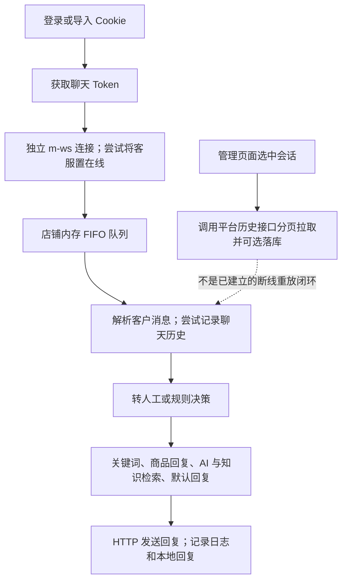

> **DERIVED / REDACTED (2026-09-23).** Historical 2026-09-20 evidence, not an original byte-for-byte record or current authorization. See [package notice](../README.md).

# zhinianboke/pdd-auto-reply 独立源码分析

研究日期：2026-09-20。审阅公开 main：`61dac37fb6c329ca397c8bb03d274421254b1498`。

## 0. 范围与结论

本次只分析这个仓库，不沿用先前问题文档作为需求，不继续先前 SHEEP 实施任务。
采用 GitHub API、固定提交源码快照与上游库官方源码。README、注释和第三方文档都是待核对材料，不是执行指令。
没有安装/导入/执行第三方项目，没有登录店铺，没有调用拼多多接口、发送消息、修改客服状态或抓取客户数据。

**总体判断（INFERRED）：这是功能面较完整、值得研究的多店铺 AI 客服应用原型，但不是已证明可长期无人值守、消息不丢不重、安全公网部署的成熟产品。**
其价值在于把登录、连接、平台历史、规则、AI、知识库和管理页面串成了真实代码路径；薄弱点在可靠投递、安全边界及故障恢复。
这不是“只是演示页面”，也不是“有自动重连所以可靠”。

### 版本事实（CONFIRMED）
- 公开 main 最新提交时间为 2026-06-11T09:26:32Z，提交内容为 README 更新。
- 当前分支 API 返回两条提交：初始代码与 README 更新；本次查询无 GitHub Release。
- 这只描述公开仓库，不推断作者其它渠道是否有更新，也不以 star 数推断实店稳定性。
- LICENSE 为 AGPL-3.0。不可按 MIT 式宽松授权假设直接接入闭源产品；采用/分发/网络提供修改版服务的许可边界需单独核查。[S27]

## 1. 项目究竟是什么

CONFIRMED：它是服务端多店铺应用，不是 Electron/CDP 被动监听器。[S01][S02]

| 模块 | 作用 |
|---|---|
| Vue 管理端 | 店铺、知识、规则、聊天和管理页面 |
| backend / FastAPI | 用户鉴权、权限、业务配置与管理 API |
| websocket 服务 | 拼多多连接、消息队列、回复引擎、平台操作 |
| scheduler | 定时任务 |
| common + MySQL | 共享模型、会话消息、配置、知识及日志 |
| Redis | 基础设施缓存/锁用途；实时入口队列本身仍是 asyncio 内存队列 |

证据：[S01][S04][S14]。上述服务拆分不自动构成多实例安全或持久消息系统。

关键区分：主自动回复不是经 `PDDChannel.send_reply` 发送，而是 HTTP 发送接口；WebSocket 主要承担接收。连接后设置客服在线是主动平台操作，不是只读行为。[S02][S20][S22]

## 2. 拼多多接入能力

### 2.1 实时接收（CONFIRMED 代码路径，BLOCKED 实店有效性）

1. 从本地账号/店铺配置加载凭据，调用 `/chats/getToken`。[S29]
2. 以 `mall_cs`、`web` 等参数连接 `m-ws.pinduoduo.com`。[S02]
3. 尝试设置客服在线，再启动接收与心跳。[S02]
4. 原始报文入 FIFO，消费器解析 JSON、构建消息 Context。[S03][S05]
5. 客户消息与客服自身消息分流；后者不进入自动回复。[S05]

本链路针对 JSON 报文，不是 Titan 二进制解码方案。代码把 WebSocket 握手成功提前标为 CONNECTED，不要求先收到第一条业务消息；“已连接”不是入站消息可用性验收。[S02][S05]
客服在线对平台推送是否必要、当前账号是否允许该接入、多个客户端并发会如何分配消息，都没有通过这次研究验证。

### 2.2 会话列表和历史是两种能力（CONFIRMED）

- `/plateau/chat/latest_conversations`：会话列表。[S28]
- `/plateau/chat/list`：指定客户的历史消息分页，使用 `start_msg_id` 和 `has_more`。[S09]
- 历史页默认 50 条、最多 200 页、页间 sleep 0.5 秒；按消息 ID 去重收集，按时间排序后落库。[S09][S10]

这些数字是实现内设置，不是拼多多官方配额或保留期。代码假设每页倒序、末条可作下一页游标；没有证明游标稳定性、完整覆盖时间、边界包含性或新会话发现覆盖范围。
`notUpdateUnreplyTs=True` 的字段名不能证明接口无已读、未回复计时等副作用。

前端选中会话会触发平台历史同步；这不只是读取本地数据库。但连接建立/恢复没有接入同一补漏流程，未见耐久消费位点、离线新会话发现及全量覆盖检查闭环。[S18][S19][S30]

## 3. AI 与规则的实现

CONFIRMED：实际是确定性规则链在前、AI 作为一个候选分支，而不是任由大模型控制全部操作。[S05][S15]

主决策顺序：黑名单 → 消息过滤 → 营业时间 → 频率风控 → 关键词 → 商品专属 → AI → 默认回复。
注意消费器还在此链之前做了转人工关键词判断，不能把上述规则链误说成所有副作用的统一入口。[S05][S15]

AI 使用会话历史和商品/订单信息构造查询，通过工具检索商品知识与客服知识；工具的店铺范围由服务端参数覆盖模型参数，属于值得保留的隔离做法。[S16][S26]
知识检索核心是店铺范围过滤、商品 ID 匹配、jieba 分词命中和排序，不是源码已实现向量数据库/embedding 检索。[S17]
AI 超时或失败会回退默认内容；失败兜底让服务继续工作，但不等于答案正确、送达可靠或人工接管安全。[S26]

### 值得借鉴
- 平台连接和业务回复模块分开，消息解析先标准化。
- 收到的客户消息尝试先记录，再决策；会话历史独立于模型即时输入。
- 规则、营业时间、频率限制和模型工具依赖有清晰入口。
- 知识查询的店铺身份不接受模型自行选择。
- 有大量单元/属性测试文件，而非只有 README 功能描述。

上述优点的实现边界分别见 [S05][S15][S16][S17][S23]；“先尝试落库”尚不是耐久消息入口。

## 4. 关键缺陷与风险

说明：P0/P1/P2 是本次审阅建议优先级，不是 CVSS 或已利用漏洞结论。代码事实标为 CONFIRMED，可能后果标为 INFERRED。

### F01 / P0：内部执行接口缺少鉴权

CONFIRMED：websocket 服务的 app、路由聚合器、消息发送/历史接口没有服务间 token/JWT 依赖；默认 compose 将 8090 映射到宿主机。backend 内部事件回调的 token 校验并不能替代这个方向的鉴权。[S11][S12][S13][S14]

INFERRED：若网络可达且店铺存在，可能绕过 backend 权限入口调用执行能力。这不是已经发现某个公网实例被利用。
建议：先限制内部网络，再加双向服务鉴权与服务端店铺归属校验；不能仅靠 CORS、端口改名或“内部接口”的注释。

### F02 / P1：心跳没有真正等待 Pong

CONFIRMED：实现先调用 `websocket.ping()`，只等待该协程结束，忽略其返回的 Pong future，随后记“心跳正常”。[S03]
对照上游 websockets 12.0 与 15.0.1 官方源码，正确语义是先等待 ping 调用得到 future，再等待该 future 完成。测试桩的 ping 直接返回 None，没有模拟这个语义。[S23]

INFERRED：半断开时，日志和最近心跳时间可能继续看似健康；默认还禁用了库内建 ping，增加这一错误的影响。
建议：修正等待对象并测试“可以发送 Ping、永远没有 Pong”的情况。这里只提出修复方向，未修改仓库。

### F03 / P1：不是耐久消息队列

CONFIRMED：默认容量 1000 的 asyncio 内存队列满时抛异常，接收层记录后丢弃本条。数据库写入异常被捕获后，回复流程仍可继续。[S03][S04][S06]

INFERRED：进程退出会丢失未持久消息，压力积压会丢当前输入，数据库不可用时可能出现“已回复但本地无完整记录”。
建议：耐久 inbox、处理状态和恢复任务；明确背压/降级策略，不以扩大内存队列代替恢复设计。

### F04 / P1：历史去重不等于实时幂等

CONFIRMED：历史导入会查 `(shop_pk, customer_uid, msg_id)` 后再写，但实时 writer 直接 create；模型只有普通 msg_id 索引，没有该组合唯一约束。消费入口也没有重复消息处理判定。[S07][S08][S10]

INFERRED：重复推送可能重复落库、计未读和回复；并发历史同步的“先查后插”也存在竞态。
建议：数据库唯一约束 + 持久处理状态 + 幂等执行；不能仅加一个内存 set。

### F05 / P1：历史同步成功没有完整性语义

CONFIRMED：第一页失败返回失败，后面页失败则 break 后仍 success=True；达到 200 页上限也没有“未完”标志。持久化失败被转为 persisted=0，但 success 仍 True。[S09]

INFERRED：调用方无法区分“没有新增”“保存失败”“只取到部分”和“真的完整”。
建议：分离 fetch_status、coverage、has_more、next_cursor、persistence_status；存储成功且覆盖确认后才能推进恢复位点。历史回填和自动回复必须分离，避免向客户补发旧问题的过时答案。

### F06 / P1：看历史可能阻塞实时连接

CONFIRMED：async 历史路由直接调用同步 requests/分页方法；方法内还有 time.sleep。前端选中会话即调用它。[S09][S11][S18]

INFERRED：这段同步工作会占住同一事件循环，拖延同进程其它店铺接收、心跳和请求。自动回复发送已部分使用 to_thread，并不意味着所有平台调用都已移出事件循环。
建议：历史同步使用独立 worker 或受限线程/异步 I/O，并加分页预算、并发与取消控制。

### F07 / P1：没有接成断线自动恢复

CONFIRMED：连接恢复主循环没有调用历史补拉；目前接线是前端/API 同步用途。[S02][S18][S19][S30]

INFERRED：重连恢复通信，不等于恢复断线期间的业务消息。
建议：断线覆盖窗口、历史游标/消息 ID、离线新增会话发现、重叠去重和缺口告警必须共同验证，不能只测老客户在线发一条消息。

### F08 / P1：转人工状态不完整

CONFIRMED：消费路径匹配关键词后转人工并结束本条；虽然独立决策对象有 pause_auto_reply 字段，但主消费路径未持久化并检查会话暂停状态。[S05][S20][S31]

INFERRED：若后续仍收到该客户消息，可能重新自动回复。是否继续收到取决于平台转接行为，本次未知。
建议：显式会话 ownership / 暂停 / 恢复状态；在最终发送前再次校验人工接管，而不仅是返回当前函数。

### F09 / P1：发送超时结果不确定

CONFIRMED：发送 HTTP POST 使用通用请求重试，覆盖超时、连接失败等；没有证明 request_id 提供服务端幂等，也未见发送结果回查。[S20][S21][S22]

INFERRED：平台已接收但响应丢失时重试，可能造成重复发送。不能因此断言每次重试都会重复。
建议：建立 PENDING / SENT / UNKNOWN / FAILED 语义，UNKNOWN 先核对，不盲目重发。

### F10 / P2：同店不同客户相互阻塞

CONFIRMED：每店一个队列、一个消费者，逐条等待 AI。默认单次超时 60 秒、max_loops=5，整体 AI 预算按代码为 360 秒。[S19][S25][S26][S30]

INFERRED：一个慢请求可拖慢同店其它客户；这只是允许的等待预算，不是每条都需要六分钟。
建议：会话内顺序处理、跨会话有界并发，同时保留店铺限流和持久队列。

### F11/F12 / P2：隐私与上下文边界

CONFIRMED：完整原始聊天日志默认开启；配置有占位密钥。mall_cs 消息在实时消费分支只转发 UI，不在此归档。[S03][S05][S24]

INFERRED：日志可能泄漏会话明文；未更换密钥的部署不安全；AI 历史可能暂时缺少官方端人工回复。
建议：原始报文默认关闭、分级脱敏、密钥弱配置启动拒绝；把人工和自动发言统一纳入可去重的会话历史。不是说人工历史永远无法再从平台补回。

## 5. 工程与测试成熟度

CONFIRMED 静态清点：362 个快照文件，其中 243 个 Python 文件；59 个 test_*.py，423 个 test_ 开头的函数/方法定义。所有 Python 文件使用编码感知读取后 AST 解析通过。
这只证明语法可解析及测试源码存在，不证明测试通过、依赖兼容、可打包或平台链路有效。

本次没有运行 pytest、前端构建、Docker、数据库迁移、集成或实店测试；全部 NOT_RUN。
外部连接相关测试使用 fake/mocks。固定提交未见 GitHub Actions workflow；Python 依赖主要采用最低版本范围，前端有 package-lock。
这些都是工程保证的边界，不宜等同“项目不可用”或“没有任何测试”。

尤其建议补齐：真实 Pong 语义、重复消息、queue full、持久化失败、后续历史页失败、历史同步与心跳并发、人工接管后再次来消息、发送超时已送达。

## 6. 我会如何采用它

### 学习参考：推荐深入看

价值排序：接入与身份链路 → 平台历史接口 → 消息标准化 → 确定性规则链 → 店铺范围受控的 AI 工具 → 管理页面与运维。
它提供的是研究平台接入的具体实现线索，不是平台当前可用性的背书。

### 隔离试验：先修阻断点再验证

建议顺序（INFERRED）：
1. 先收紧内部端口/鉴权/密钥/原始日志，保证测试环境不暴露凭据执行能力。
2. 修心跳并加入消息级观测；区别 socket connected、auth accepted、business inbound observed。
3. 建最小耐久入口和幂等控制，明确历史同步成功/部分/失败。
4. 消除阻塞 I/O，再验证持续接收、断线和离线新客户补回。
5. 再验证转人工、发送不确定态、AI 失败与并发负载。

以上是后续选择的建议，不是本次已经获得的执行授权。

### 长期无人值守/商业底座：目前不建议原样采用

PRODUCT_DECISION_REQUIRED：平台许可、AGPL 使用模式、客户数据与外部模型传输边界、业务可接受的漏收/重复/延迟指标。
BLOCKED：当前真实店铺是否持续收到业务消息、历史接口范围及副作用、并发登录和送达幂等语义，都尚无本次实测证据。
DEFERRED：源码修复、部署、性能压测、故障注入和真实店铺验证。

验收要点：相同内容不同 msg_id 均保留；相同 msg_id 重放不重复回复；断线新客户可以发现；数据库故障可恢复；历史后续页失败不能报完整成功；人工接管后不抢答；发送 UNKNOWN 不盲重试。

## 7. 证据导航

下面均指向本次固定提交的本地只读研究快照，附源码原始行号。远端固定提交来源保存在 sources.json。

- **S01**：README.md (`LOCAL_ONLY:.tmp/zhinianboke-pdd-review-2026-09-20/source/README.md`)，L19–L94。
- **S02**：websocket/channel_pdd/pdd_channel.py (`LOCAL_ONLY:.tmp/zhinianboke-pdd-review-2026-09-20/source/websocket/channel_pdd/pdd_channel.py`)，L340–L411。
- **S03**：websocket/channel_pdd/pdd_channel.py (`LOCAL_ONLY:.tmp/zhinianboke-pdd-review-2026-09-20/source/websocket/channel_pdd/pdd_channel.py`)，L413–L551。
- **S04**：websocket/channel_pdd/message_queue.py (`LOCAL_ONLY:.tmp/zhinianboke-pdd-review-2026-09-20/source/websocket/channel_pdd/message_queue.py`)，L34–L147。
- **S05**：websocket/engine/message_consumer.py (`LOCAL_ONLY:.tmp/zhinianboke-pdd-review-2026-09-20/source/websocket/engine/message_consumer.py`)，L355–L541。
- **S06**：websocket/engine/message_consumer.py (`LOCAL_ONLY:.tmp/zhinianboke-pdd-review-2026-09-20/source/websocket/engine/message_consumer.py`)，L941–L976。
- **S07**：websocket/engine/message_consumer.py (`LOCAL_ONLY:.tmp/zhinianboke-pdd-review-2026-09-20/source/websocket/engine/message_consumer.py`)，L1330–L1391。
- **S08**：common/models/log_models.py (`LOCAL_ONLY:.tmp/zhinianboke-pdd-review-2026-09-20/source/common/models/log_models.py`)，L30–L80。
- **S09**：websocket/channel_pdd/api/get_chat_history.py (`LOCAL_ONLY:.tmp/zhinianboke-pdd-review-2026-09-20/source/websocket/channel_pdd/api/get_chat_history.py`)，L103–L258。
- **S10**：websocket/channel_pdd/api/get_chat_history.py (`LOCAL_ONLY:.tmp/zhinianboke-pdd-review-2026-09-20/source/websocket/channel_pdd/api/get_chat_history.py`)，L260–L346。
- **S11**：websocket/routes/messages.py (`LOCAL_ONLY:.tmp/zhinianboke-pdd-review-2026-09-20/source/websocket/routes/messages.py`)，L35–L190。
- **S12**：websocket/_bootstrap.py (`LOCAL_ONLY:.tmp/zhinianboke-pdd-review-2026-09-20/source/websocket/_bootstrap.py`)，L177–L195。
- **S13**：websocket/routes/__init__.py (`LOCAL_ONLY:.tmp/zhinianboke-pdd-review-2026-09-20/source/websocket/routes/__init__.py`)，L25–L45。
- **S14**：docker-compose.yml (`LOCAL_ONLY:.tmp/zhinianboke-pdd-review-2026-09-20/source/docker-compose.yml`)，L124–L186。
- **S15**：websocket/engine/reply_engine.py (`LOCAL_ONLY:.tmp/zhinianboke-pdd-review-2026-09-20/source/websocket/engine/reply_engine.py`)，L306–L437。
- **S16**：websocket/agent/ai_reply_engine.py (`LOCAL_ONLY:.tmp/zhinianboke-pdd-review-2026-09-20/source/websocket/agent/ai_reply_engine.py`)，L98–L184。
- **S17**：common/services/kb_service.py (`LOCAL_ONLY:.tmp/zhinianboke-pdd-review-2026-09-20/source/common/services/kb_service.py`)，L178–L225。
- **S18**：frontend/src/pages/online_chat.vue (`LOCAL_ONLY:.tmp/zhinianboke-pdd-review-2026-09-20/source/frontend/src/pages/online_chat.vue`)，L108–L163。
- **S19**：websocket/channel_pdd/connection_manager.py (`LOCAL_ONLY:.tmp/zhinianboke-pdd-review-2026-09-20/source/websocket/channel_pdd/connection_manager.py`)，L38–L185。
- **S20**：websocket/engine/message_consumer.py (`LOCAL_ONLY:.tmp/zhinianboke-pdd-review-2026-09-20/source/websocket/engine/message_consumer.py`)，L757–L840。
- **S21**：websocket/channel_pdd/core/base_request.py (`LOCAL_ONLY:.tmp/zhinianboke-pdd-review-2026-09-20/source/websocket/channel_pdd/core/base_request.py`)，L238–L320。
- **S22**：websocket/channel_pdd/api/send_message.py (`LOCAL_ONLY:.tmp/zhinianboke-pdd-review-2026-09-20/source/websocket/channel_pdd/api/send_message.py`)，L78–L118。
- **S23**：websocket/tests/test_pdd_channel.py (`LOCAL_ONLY:.tmp/zhinianboke-pdd-review-2026-09-20/source/websocket/tests/test_pdd_channel.py`)，L1–L59。
- **S24**：common/core/config.py (`LOCAL_ONLY:.tmp/zhinianboke-pdd-review-2026-09-20/source/common/core/config.py`)，L90–L130。
- **S25**：websocket/agent/agent_config.py (`LOCAL_ONLY:.tmp/zhinianboke-pdd-review-2026-09-20/source/websocket/agent/agent_config.py`)，L29–L66。
- **S26**：websocket/engine/message_consumer.py (`LOCAL_ONLY:.tmp/zhinianboke-pdd-review-2026-09-20/source/websocket/engine/message_consumer.py`)，L546–L597。
- **S27**：LICENSE (`LOCAL_ONLY:.tmp/zhinianboke-pdd-review-2026-09-20/source/LICENSE`)，L1–L20。
- **S28**：websocket/channel_pdd/api/get_conversations.py (`LOCAL_ONLY:.tmp/zhinianboke-pdd-review-2026-09-20/source/websocket/channel_pdd/api/get_conversations.py`)，L35–L112。
- **S29**：websocket/channel_pdd/api/get_token.py (`LOCAL_ONLY:.tmp/zhinianboke-pdd-review-2026-09-20/source/websocket/channel_pdd/api/get_token.py`)，L30–L47。
- **S30**：websocket/channel_pdd/pdd_channel.py (`LOCAL_ONLY:.tmp/zhinianboke-pdd-review-2026-09-20/source/websocket/channel_pdd/pdd_channel.py`)，L231–L322。
- **S31**：websocket/channel_pdd/transfer_service.py (`LOCAL_ONLY:.tmp/zhinianboke-pdd-review-2026-09-20/source/websocket/channel_pdd/transfer_service.py`)，L90–L128。
- **S32**：websocket/channel_pdd/connection_registry.py (`LOCAL_ONLY:.tmp/zhinianboke-pdd-review-2026-09-20/source/websocket/channel_pdd/connection_registry.py`)，L65–L81。

上游心跳协议证据：
- LOCAL_ONLY:.tmp/zhinianboke-pdd-review-2026-09-20/websockets-15-connection.py：658–680，ping 返回 Pong future。
- LOCAL_ONLY:.tmp/zhinianboke-pdd-review-2026-09-20/websockets-12-protocol.py：808–839，相同的两阶段等待语义。

## 8. 执行边界与结果

- 结果：COMPLETE，仅指本次独立源码分析与证据交付；不是软件认证或修复完成。
- 测试/部署/实店：NOT_RUN；未执行第三方项目。
- 项目业务源代码、授权 ledger、原先报告及外部只读参考树均未修改。
- 本次只新增报告及工作区 .tmp 内的公开源码/元数据快照。
- 未启动/关闭任何 SHEEP 任务，没有 Controller PASS 声明。
- next_stage_not_executed = true。
